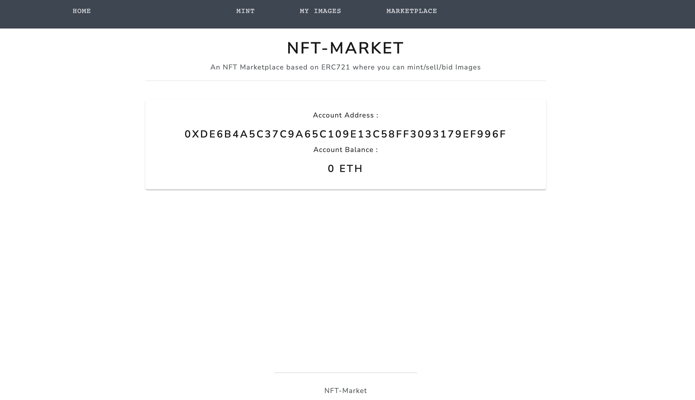
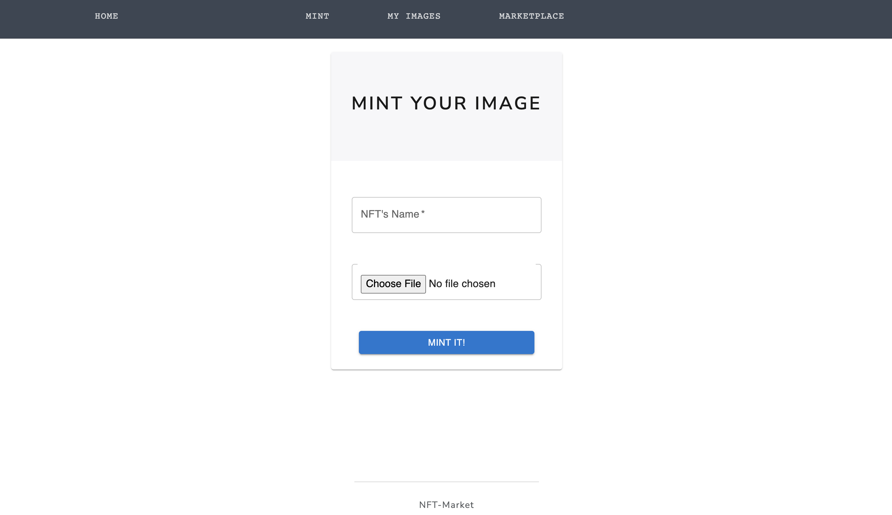
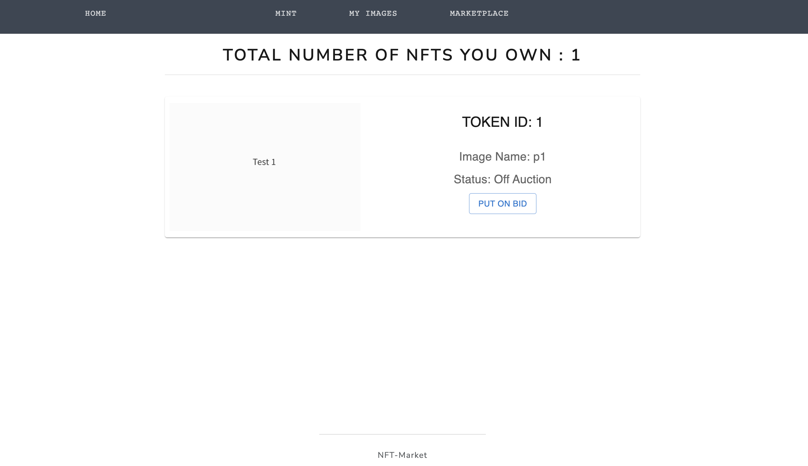
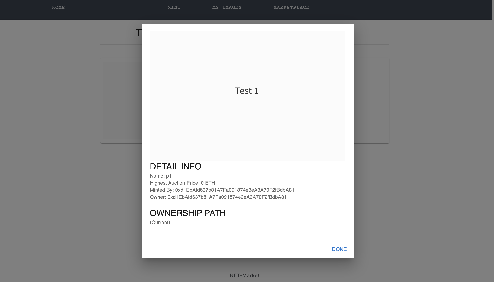
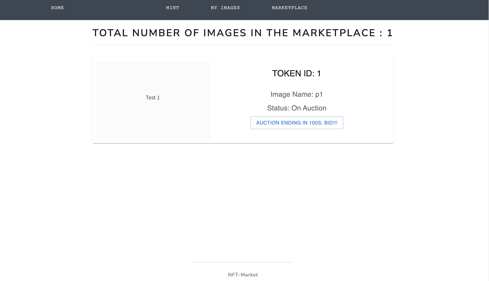

# NFT Market

An NFT Merketplace where you can mint/auction/bid Image NFTs.

### Technology Stack

[Solidity](https://docs.soliditylang.org/en/v0.7.6/)
[Bootstrap 4](https://getbootstrap.com/)
[React.js](https://reactjs.org/)
[web3.js](https://web3js.readthedocs.io/en/v1.3.4/)
[Truffle](https://www.trufflesuite.com/truffle)
[Ganache](https://www.trufflesuite.com/ganache)

### How to Run

#### Install truffle

```
npm install -g truffle
```

#### Install ganache-cli

```
npm i ganache-cli
```

#### Run ganache-cli

```
ganache-cli --port 8545
```

#### Open new terminal window and clone this repository

```
git clone git@github.com:Yinwhe/NFT-Market.git
```

#### Install dependencies

```
cd NFT-Market
```

#### Compile and deploy smart contract to ganache

```
truffle migrate
```

#### Install needed environment

```
npm install
```

#### Start DApp

```
npm start
```


### Demonstration










